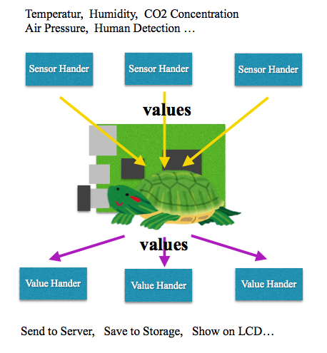

# pondslider
Multipurpose sensorhandler, read the value from source & do somethings (send, save, trigger, ...) with it, as configed.


## What is pondslider
The pondslider is a python module to read sensor values by Sensor handler, and do somethins with the value by Value handler.



### What is pondslider for?
The pondslider is for making IoT device side project quickly by ***reusing existing codes***.

- Reusing ***Sensor reading*** code.
- Reusing ***Value handling*** code.


### How the pondslider work?
First, the pondslider read a configration file to specify:

- Which sensors shoul be read.
- Which values are returned by specific sensor.
- What shoud it do for each value.

Then, pondslider read sensor values through specific ***sensor handlers***, and call ***value handlers*** which is specified for the value.

### What is Sensor handler?
The Sensor handler is a python module which wrap existing sensor value reading code to provide unified interface as follows:

- unified read() function
Sensor handler unifies various function call of sensor value reading on the existing codes as ***read()***

- well-formed return value:
The ***read()*** function return a python dictionally of ***name*** and ***value*** pairs as follow:

``` {'humiditydeficit': 15.9, 'temp': 26.8, 'humidity': 37.6}```


Typically, a sensor handler is created with exising python module for sensor value reading as:

```python:
import SomethingExistingSensorModule

def read():
  a_sensor = SomethingExistingSensorModule.new()
  values   = a_sensor.read()
  return adjust_the_format(values)

def adjust_the_format(value)
  ''' adjst the format of value as a dictionaly of name & value pair. '''

```

In other case, with external executable file,

```python:
import subprocess

def read():
  p = subprocess.Popen("./SomethingExistingExecutable2GetSensorValue",
                       stdout=subprocess.PIPE,
                       stderr=subprocess.PIPE, 
                       shell=True)
  std_out, std_err = p.communicate(None, timeout=20)
  value = std_out.strip()

def adjust_the_format(value)
  ''' adjst the format of value as a dictionaly of name & value pair. '''

```


## install

```bash:
pip install pondslider
```

## input
config.toml. The contents are expected as follows:

```
[[sensors]]
  handler   = "dht22"
  [[sensors.values]]
    name = "temp"
    handlers = [
      "send",
      "save"
    ]
  [[sensors.values]]
    name = "humidity"
    handlers = [
      "send",
      "save"
    ]
  [[sensors.values]]
    name = "humiditydeficit"
    handlers = [
      "send",
      "save"
    ]


[[sensors]]
  handler   = "mh-z19"
  [[sensors.values]]
    name = "co2"
    handlers = [
      "send",
      "save"
  ]
```

Each element of the array of table ***sources*** correspond to one actual data source like a Sensor Device and so on. Tha table is consist of ***handler *** and ***value***.

- handler: Python module of Sensor handler. The pondslider import this module dynamically and call function ***read()*** to get value. The returned value is expecte as a dictionally as key of ***value name*** and correcponding value like:

``` {'humiditydeficit': 15.9, 'temp': 26.8, 'humidity': 37.6}```

- values: The array of table corresponding to the python dictionally of values which is the returned value of read() mentioned above. The table is consist of ***name*** and ***handlers***. 
  - name: The key of dictionally of values like "humiditydeficit", "temp", "humidity" on the above example.

  - handlers: The array of Python module of Value handler's. The pondslider import these modules dynamically and call function ***handle(source_modlue, name, value)*** for each acquired value. You can 

## How to use 
### as python program.

```bash:
python -m sensorhandler [--config config_file_path] [--imppath python_module_import_path] [ --list_imppath list_of_python_module_import_path]
```
In case no --config, "config.toml" on the running path is used.
The path specified by --imppath and --list_imppath is used ad additional Python import library path.

### as python library.

```python:
import sensorhandler

print (sensorhandler.read(config_file_path))
```
## Q&A
Any questions, suggestions, reports are welcome! Please make [issue](https://github.com/UedaTakeyuki/sensorhandler/issues) without hesitation! 

## history
- 0.1.1  2018.11.03  first version self-forked from [sensorhandler](https://github.com/UedaTakeyuki/sensorhandler)
